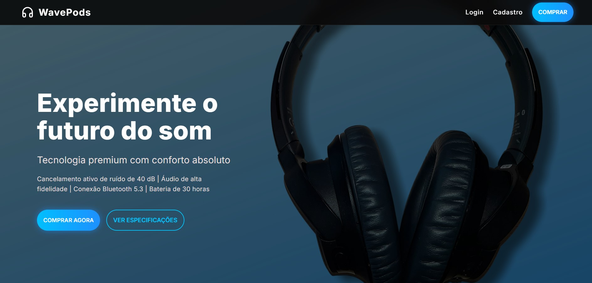
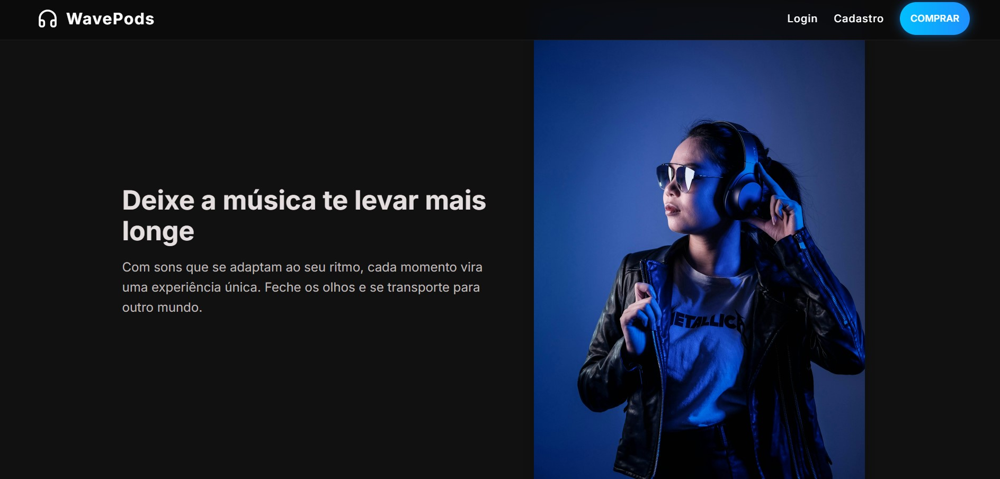
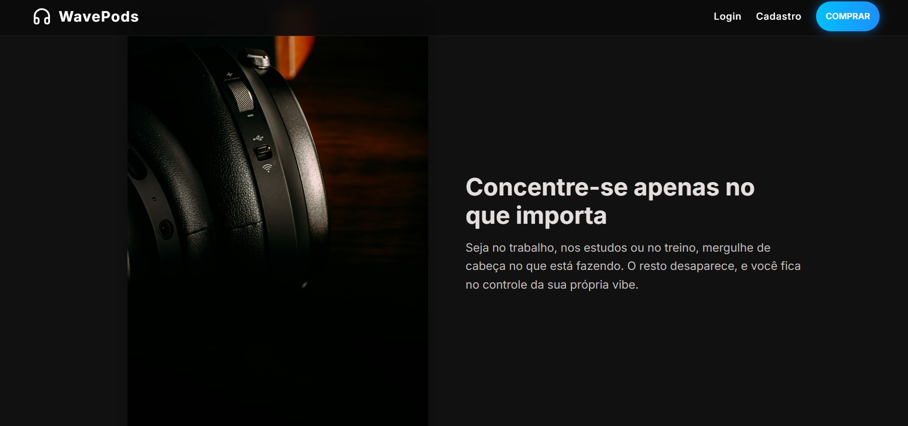
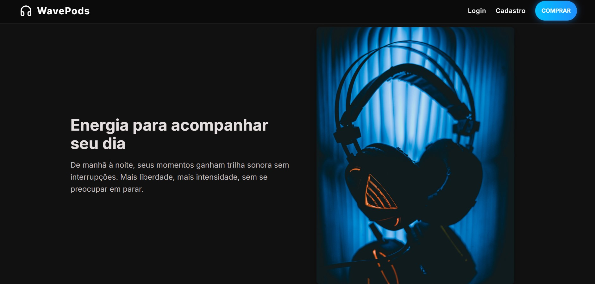
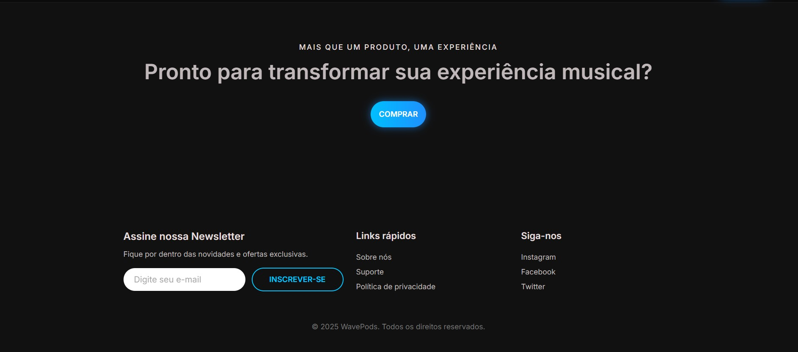

# WavePods — Fullstack Landing Page

WavePods is a professional-level project developed to practice modern fullstack development. It features a fully customized interface, a robust Node.js backend, and a secure payment flow integrated with Stripe.

- Frontend: Built with React + Vite & Material UI.
- Backend: Node.js + Express with modular architecture.
- Infrastructure: Fully containerized using Docker & Nginx.
- Payments: Secure integration with Stripe Checkout.
- Validation: Custom email validation on the server side and security headers.

## Features

- Responsive Design: Smooth experience across mobile, tablet, and desktop devices.
- Clean Architecture: Clear separation of responsibilities between routes, controllers, and utilities.
- Email Validation: Custom Regex-based validation in the backend for lead capture.
- Security: Dynamic CORS policy to support multiple environments (Dev/Prod).
- Dockerized: Single-command setup for both frontend and backend.

## Quality Assurance & Testing

To ensure reliability and professional standards, the backend is covered by a comprehensive test suite using **Vitest** and **Supertest**:

- **Unit Testing:** 100% coverage on core business logic, such as the custom email validation utility.
- **Integration Testing:** Validation of API endpoints to ensure correct HTTP status codes (200, 422) and JSON responses.
- **Stripe Mocking:** Implementation of advanced mocking techniques to simulate Stripe API responses, allowing safe and fast testing of checkout flows without external dependencies or additional costs.

To run the tests, navigate to the server directory:

```
cd server
npm test
```

To view the coverage report:

```
npm run coverage
```

## Project Structure

```
landing_wavepods/
├── client/                 # React + Vite frontend
│   ├── src/
│   │   ├── api/            # API service layer
│   │   └── components/     # Modular UI components
│   └── nginx.conf          # Nginx production configuration
│
├── server/                 # Node.js + Express backend
│   ├── routes/             # Modular API routes
│    ├── controllers/        # Request handlers
│    ├── tests/              # Vitest & Supertest suite (Unit & Integration)
│   ├── utils/              # Helper functions (validation, etc.)
│   ├── index.js            # Main server entry point
│   └── .env.production     # Production variables (git ignored)
│
├── docker-compose.yml      # Full stack orchestration
└── package.json            # Scripts for Dev/Prod environments
```

## Technologies

**Frontend**

- React (Vite)
- React Router DOM
- Material UI
- Framer Motion (optional)

**Backend**

- Node.js + Express
- Stripe API / Stripe Node SDK
- Vitest & Supertest (Testing)
- dotenv
- CORS

**Infrastructure (Ops)**

- Docker
- Docker Compose
- Nginx

## Environment Variables

To run this project, you’ll need a .env file (local development) and a .env.production file (Docker).

**Local Development (server/.env)**

```
STRIPE_SECRET_KEY=sk_test_...
STRIPE_PRICE_ID=price_...
FRONTEND_URL=http://localhost:5173
PORT=4242
```

**Docker Production (server/.env.production)**

```
STRIPE_SECRET_KEY=
STRIPE_PRICE_ID=
FRONTEND_URL=http://localhost:8080
PORT=4242
```

## Running the Project

### Option 1 — Docker (Recommended)

```
docker-compose up --build
```

Access the application at: http://localhost:8080

This command:

- Builds the frontend (React + Vite)
- Builds the backend (Node + Express)
- Starts Nginx serving the frontend
- Proxies /api/\* requests to the backend

**URLs**

- Frontend: http://localhost:8080
- Backend (via proxy): http://localhost:8080/api
- Direct backend access: http://localhost:4242

To stop the containers: CTRL + C or docker-compose down

## Option 2 — Local Dev Mode

1. Clone the repository

```
git clone https://github.com/CarolinaVirginio/landing_wavepods.git
cd landing_wavepods
```

2. Install dependencies in both folders.

**Client**

```
cd client
npm install
```

**Server**

```
cd server
npm install
```

3. Create your environment variables:

Inside /server, create a .env file:

```
STRIPE_SECRET_KEY=
STRIPE_PRICE_ID=
FRONTEND_URL=http://localhost:5173
PORT=4242
```

4. Run from the root folder:

```
cd ..
npm run dev
```

Access the application at: http://localhost:5173

This command:

- Starts the backend using nodemon
- Starts the frontend with Vite
- Keeps both running simultaneously using concurrently

**URLs:**

Frontend: http://localhost:5173

Backend: http://localhost:4242

## Screenshots

**(Click to enlarge)**

[](./client/public/contentmain.jpeg)
[](./client/public/features.jpeg)
[](./client/public/motivation1.jpeg)
[](./client/public/motivation2.jpeg)
[](./client/public/motivation3.jpeg)
[](./client/public/buysection-footer.jpeg)

## Author

**Carolina Virginio**

Developed as part of my frontend portfolio and fullstack learning journey.

## License

© 2025 Carolina Virginio. All rights reserved.
This project is proprietary and may not be copied or used without permission.
